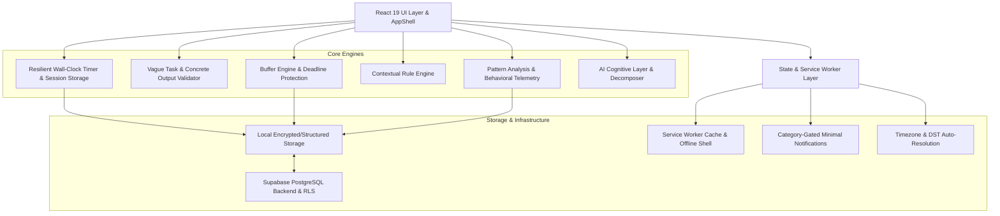

# START — Architecture & System Design

## 1. System Philosophy: Anti-Procrastination Operating System

Traditional productivity software treats procrastination as a failure of time management or lack of discipline, providing users with passive todo lists, calendar boxes, and stopwatch timers.

**START rejects this premise.** Procrastination is a neurobiological threat-avoidance response. When the brain encounters an abstract, vague, or intimidating task ("Study Machine Learning", "Work on thesis"), the limbic system registers discomfort and uncertainty. To relieve this immediate tension, the nervous system flees into low-friction, high-dopamine alternatives (social media, messaging, micro-distractions).

START is architected around behavioral invariants that eliminate ambiguity and dismantle starting resistance:
1. **No Abstract Commitments**: Every work slot requires a tangible, visible output (what exists at 00:00) and an unambiguous 15-second physical action.
2. **Implementation Intentions**: Pre-committing to an obstacle response ("If X happens, then I will do Y") automates executive control during moments of hesitation.
3. **Friction Engineering**: Requiring physical phone separation prior to starting reduces the cognitive energy spent on constant impulse inhibition.
4. **10-Minute Recovery Protocols**: Missed slots do not trigger shame or failure spirals; they offer immediate, low-resistance rescue sessions.
5. **Night Review Over Journaling**: Night review does not ask for emotional journaling; it translates today's telemetry into tomorrow's non-negotiable Top 1 slot.

---

## 2. High-Level Component Architecture

---

## 3. Subsystem Breakdown

### 3.1. Onboarding & Operating Profile Synthesis
- **Location**: `src/features/onboarding/`
- **Flow**: Multi-step diagnostic capturing work domain, primary procrastination triggers (perfectionism, ambiguity, exhaustion, phone distraction), typical daily schedule, upcoming urgent deadlines, and immediate commitment.
- **Synthesis**: Generates an actionable *Personal Operating Profile* with primary blockers, tailored defense protocols, and pre-initializes the user's first work slot and assignment milestones.

### 3.2. Assignment Decomposition & Buffer Engine
- **Location**: `src/features/assignments/`
- **Milestone Breakdown**: Large deliverables are split into ordered steps with individual visible proof and physical next actions.
- **Buffer Engine (`bufferEngine.ts`)**:
  - Compares remaining estimated effort against available working days until the hard deadline.
  - Computes buffer status: `healthy` ($> 48\text{h}$ margin), `warning` ($24\text{h} - 48\text{h}$ margin), or `danger` ($< 24\text{h}$ margin).
  - Emits real-time behavioral alerts when assignments enter the critical danger zone without scheduled focus slots.

### 3.3. Work Slot Planning & Behavioral Invariants
- **Location**: `src/features/planner/`
- **Enforcement**:
  - `vagueTaskValidator.ts` analyzes outputs and first physical actions. Rejects abstract words ("study", "work on it", "learn") and empty finish lines.
  - `ClarifySlotModal.tsx` intercepts slot starts from any view (`/today`, `/planner`) if the output or physical starter is missing or vague.
  - `PlanSlotModal.tsx` enforces 9 structured planning steps: Target $\rightarrow$ Desired Output $\rightarrow$ 15-Second Action $\rightarrow$ Duration $\rightarrow$ Likely Obstacle $\rightarrow$ If-Then Plan $\rightarrow$ Phone Placement $\rightarrow$ Restorative Break $\rightarrow$ Confirmation.
  - **Capacity Guard**: Warns when planned deep work exceeds 6 hours ($360$ minutes), protecting against ambitious overbooking that leads to abandonment.
  - **Overlap Detection**: Detects collisions between scheduled time windows.

### 3.4. Active Session Engine & Resilient Countdown
- **Location**: `src/features/sessions/WorkSessionView.tsx`, `sessionStorage.ts`
- **Resilience Against Timer Drift**:
  - Traditional `setInterval` timers freeze or drift when tabs are backgrounded or OS enters sleep.
  - START uses **wall-clock timestamp delta math** (`Date.now() - startedAt - pausedIntervals`).
  - Listens to `document.addEventListener('visibilitychange')` and `window.addEventListener('focus')` to immediately re-sync state upon tab return.
- **Browser Title Bar Live Countdown**:
  - Dynamic `document.title` ticker (e.g. `⏱ (14:32) Implement auth route • START` or `⏸ [Paused]`).
- **Zero-Latency Audio & Completion Bell**:
  - Web Audio API synthesizer (`utils/sound.ts`) produces clean physical frequencies without external asset loading.
  - Dispatches browser notification and auto-opens `CloseSessionModal` at `00:00`.

### 3.5. Distraction Urge Logging
- **Location**: `src/features/sessions/DistractionCaptureModal.tsx`
- **Cognitive Shift**: Rather than fighting distraction with willpower (which induces ego depletion), the user opens the quick-capture modal (`Ctrl/Cmd + D`), writes down the urge, categories it (phone, sudden thought, boredom, hunger), and returns to work within 10 seconds.
- Logged urges feed the Night Review and Weekly Pattern Analysis engines.

### 3.6. 10-Minute Recovery Protocol
- **Location**: `src/features/sessions/RecoveryModal.tsx`
- **Behavioral Rationale**: When a planned slot is missed, conventional todo lists highlight red failures, provoking shame and giving up on the day.
- START detects missed slots and displays: *"Recover in 10 minutes"*.
- It scales the task down to an ultra-low-friction 10-minute micro-action with zero resistance. Starting 10 minutes resets dopamine and saves the workday.

### 3.7. Night Review & Tomorrow's Top 1 Setup
- **Location**: `src/features/reviews/NightReviewWizard.tsx`, `ReviewPage.tsx`
- **5 Structured Steps**:
  1. **Factual Telemetry Summary**: Planned vs started vs completed slots, focus minutes, start delay, distractions. (No fake gamified productivity scores).
  2. **Actual Output Confirmation**: Validating what was tangibly produced.
  3. **Procrastination Event Post-Mortem**: Reviewing missed slots and delayed starts to identify root friction triggers.
  4. **What Helped Today?**: Identifying positive environmental anchors (phone in another room, clear first step).
  5. **Tomorrow's Plan & Non-Negotiable Top 1**: Enforces choosing and configuring tomorrow's Top 1 slot before the review can be closed.

### 3.8. Empirical Pattern Analysis Engine
- **Location**: `src/features/analytics/`
- **Strict Evidence Guard**: Pattern reflections are only generated when verifiable behavioral logs exist (e.g. $\ge 3$ recorded events).
- Zero psychiatric diagnosing or moralizing language ("lazy", "ADHD"). Purely factual observations:
  - *"Observed Pattern: You delay sessions that have vague outputs."*
  - *"Observed Pattern: Phone distraction was recorded in 5 sessions this week."*
  - *"Observed Pattern: You recovered from 3 missed slots rather than abandoning the day."*

### 3.9. AI Reasoning Layer
- **Location**: `src/features/ai/`
- **Deterministic Prompt Schemas**: AI is strictly used as an analytical reasoning assistant for task decomposition, 15-second action generation, and obstacle planning.
- Never fabricates metrics or executes destructive autonomous day rewrites without explicit user confirmation.

### 3.10. PWA, Service Worker & Minimal Notifications
- **Location**: `public/sw.js`, `src/services/serviceWorkerManager.ts`, `notificationService.ts`, `timezone.ts`
- **Offline Shell**: Cache-first for compiled assets with Network-First navigation fallback for instantaneous offline loading.
- **Anti-Spam Notification Policy**: Strictly bounded to 4 operational categories:
  1. `slotReminder`: 10 minutes before planned work slot.
  2. `nextAction`: Immediate next action reminder when slot start arrives.
  3. `recoveryOffer`: 10-minute recovery offer after a missed slot.
  4. `nightReview`: Daily night review invitation at 21:00.
  Zero motivational fluff or spam. User has per-category granular toggle control.
