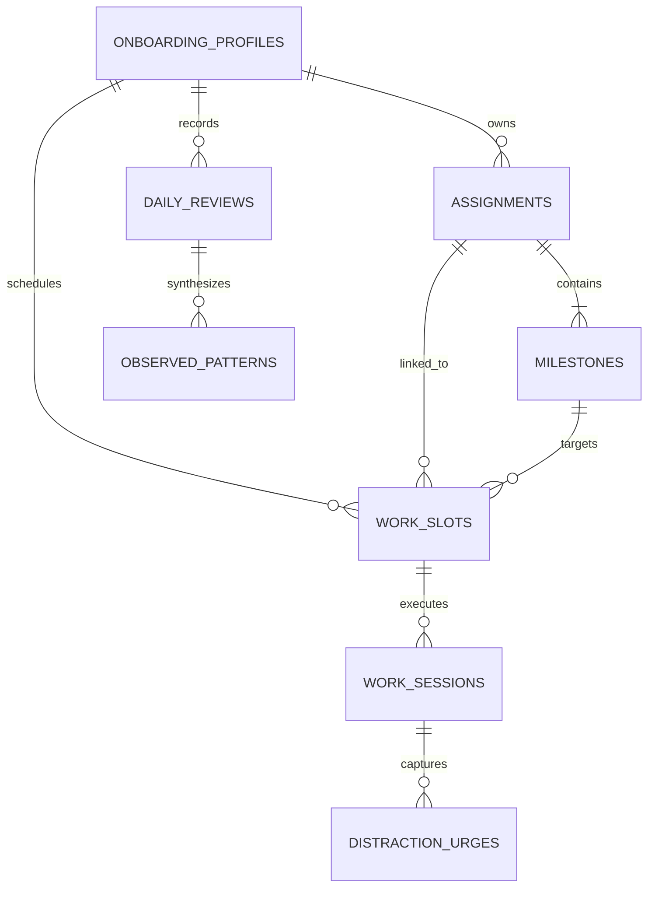

# START — Database Schema & Data Models

This document defines the relational database schema, TypeScript model interfaces, foreign key constraints, and Supabase Row-Level Security (RLS) policies for the START Anti-Procrastination Operating System.

---

## 1. Entity-Relationship Diagram



---

## 2. Table Specifications (PostgreSQL & TypeScript Interfaces)

### 2.1. `onboarding_profiles`
Stores the user's initial behavioral diagnosis and generated operating manual.

```sql
CREATE TABLE onboarding_profiles (
  id UUID PRIMARY KEY REFERENCES auth.users(id) ON DELETE CASCADE,
  name TEXT NOT NULL,
  primary_role TEXT NOT NULL DEFAULT 'General',
  procrastination_triggers TEXT[] NOT NULL DEFAULT '{}',
  ideal_focus_block_minutes INT NOT NULL DEFAULT 40,
  phone_protocol_default TEXT NOT NULL DEFAULT 'outside reach',
  operating_profile JSONB NOT NULL DEFAULT '{}'::jsonb,
  completed_at TIMESTAMPTZ NOT NULL DEFAULT NOW(),
  created_at TIMESTAMPTZ NOT NULL DEFAULT NOW(),
  updated_at TIMESTAMPTZ NOT NULL DEFAULT NOW()
);
```

### 2.2. `assignments`
Tracks major long-term deliverables, courses, or complex projects.

```sql
CREATE TABLE assignments (
  id UUID PRIMARY KEY DEFAULT gen_random_uuid(),
  user_id UUID NOT NULL REFERENCES auth.users(id) ON DELETE CASCADE,
  title TEXT NOT NULL,
  category TEXT NOT NULL DEFAULT 'General',
  description TEXT DEFAULT '',
  deadline TIMESTAMPTZ NOT NULL,
  estimated_total_hours NUMERIC(6, 2) NOT NULL DEFAULT 8.0,
  importance TEXT NOT NULL CHECK (importance IN ('low', 'medium', 'high', 'critical')),
  status TEXT NOT NULL CHECK (status IN ('not_started', 'in_progress', 'completed', 'archived')),
  next_action TEXT NOT NULL,
  progress_percent INT NOT NULL DEFAULT 0 CHECK (progress_percent BETWEEN 0 AND 100),
  created_at TIMESTAMPTZ NOT NULL DEFAULT NOW(),
  updated_at TIMESTAMPTZ NOT NULL DEFAULT NOW()
);

CREATE INDEX idx_assignments_user_deadline ON assignments(user_id, deadline ASC);
CREATE INDEX idx_assignments_status ON assignments(user_id, status);
```

### 2.3. `milestones`
Tangible breakdown steps belonging to an assignment. Enforces visible proof and physical starter actions.

```sql
CREATE TABLE milestones (
  id UUID PRIMARY KEY DEFAULT gen_random_uuid(),
  assignment_id UUID NOT NULL REFERENCES assignments(id) ON DELETE CASCADE,
  title TEXT NOT NULL,
  intended_output TEXT NOT NULL, -- Concrete evidence of completion
  next_action TEXT NOT NULL,     -- 15-second physical starter
  sequence INT NOT NULL DEFAULT 0,
  estimated_hours NUMERIC(5, 2) NOT NULL DEFAULT 2.0,
  status TEXT NOT NULL CHECK (status IN ('not_started', 'in_progress', 'completed')),
  target_date DATE,
  completed_at TIMESTAMPTZ,
  created_at TIMESTAMPTZ NOT NULL DEFAULT NOW()
);

CREATE INDEX idx_milestones_assignment_seq ON milestones(assignment_id, sequence ASC);
```

### 2.4. `work_slots`
Structured focus blocks planned for specific dates and times.

```sql
CREATE TABLE work_slots (
  id UUID PRIMARY KEY DEFAULT gen_random_uuid(),
  user_id UUID NOT NULL REFERENCES auth.users(id) ON DELETE CASCADE,
  date DATE NOT NULL, -- YYYY-MM-DD
  start_time TIME NOT NULL, -- HH:mm
  end_time TIME NOT NULL,   -- HH:mm
  assignment_id UUID REFERENCES assignments(id) ON DELETE SET NULL,
  milestone_id UUID REFERENCES milestones(id) ON DELETE SET NULL,
  task_title TEXT NOT NULL,
  desired_output TEXT NOT NULL,
  first_physical_action TEXT NOT NULL,
  estimated_duration_minutes INT NOT NULL DEFAULT 25,
  status TEXT NOT NULL CHECK (status IN ('planned', 'in_progress', 'completed', 'missed', 'recovered')),
  slot_type TEXT NOT NULL DEFAULT 'custom_task',
  is_top_priority INT CHECK (is_top_priority IN (1, 2, 3)),
  prepared_data JSONB NOT NULL DEFAULT '{}'::jsonb,
  created_at TIMESTAMPTZ NOT NULL DEFAULT NOW(),
  updated_at TIMESTAMPTZ NOT NULL DEFAULT NOW()
);

CREATE INDEX idx_work_slots_user_date ON work_slots(user_id, date ASC, start_time ASC);
```

### 2.5. `work_sessions`
Verifiable execution telemetry recorded after a session concludes.

```sql
CREATE TABLE work_sessions (
  id UUID PRIMARY KEY DEFAULT gen_random_uuid(),
  user_id UUID NOT NULL REFERENCES auth.users(id) ON DELETE CASCADE,
  work_slot_id UUID REFERENCES work_slots(id) ON DELETE SET NULL,
  assignment_id UUID REFERENCES assignments(id) ON DELETE SET NULL,
  milestone_id UUID REFERENCES milestones(id) ON DELETE SET NULL,
  task_title TEXT NOT NULL,
  actual_duration_minutes INT NOT NULL DEFAULT 0,
  target_duration_minutes INT NOT NULL DEFAULT 25,
  start_delay_minutes INT NOT NULL DEFAULT 0,
  resistance_level INT NOT NULL DEFAULT 3 CHECK (resistance_level BETWEEN 1 AND 5),
  energy_level INT NOT NULL DEFAULT 3 CHECK (energy_level BETWEEN 1 AND 5),
  phone_outside_reach BOOLEAN NOT NULL DEFAULT TRUE,
  produced_output TEXT NOT NULL,
  distractions_captured_count INT NOT NULL DEFAULT 0,
  is_output_complete TEXT NOT NULL CHECK (is_output_complete IN ('complete', 'partial', 'not_yet')),
  was_recovery_session BOOLEAN NOT NULL DEFAULT FALSE,
  pauses_count INT NOT NULL DEFAULT 0,
  early_termination BOOLEAN NOT NULL DEFAULT FALSE,
  started_at TIMESTAMPTZ NOT NULL,
  ended_at TIMESTAMPTZ NOT NULL DEFAULT NOW()
);

CREATE INDEX idx_work_sessions_user_started ON work_sessions(user_id, started_at DESC);
```

### 2.6. `distraction_urges`
Impulses caught and externalized during deep work sessions.

```sql
CREATE TABLE distraction_urges (
  id UUID PRIMARY KEY DEFAULT gen_random_uuid(),
  user_id UUID NOT NULL REFERENCES auth.users(id) ON DELETE CASCADE,
  work_session_id UUID REFERENCES work_sessions(id) ON DELETE CASCADE,
  urge_description TEXT NOT NULL,
  category TEXT NOT NULL CHECK (category IN ('phone', 'web_browse', 'sudden_idea', 'hunger_snack', 'chore', 'other')),
  handled_action TEXT NOT NULL DEFAULT 'logged_for_later',
  created_at TIMESTAMPTZ NOT NULL DEFAULT NOW()
);

CREATE INDEX idx_distractions_user_session ON distraction_urges(user_id, work_session_id);
```

### 2.7. `daily_reviews`
End-of-day behavioral post-mortems and planning records.

```sql
CREATE TABLE daily_reviews (
  id UUID PRIMARY KEY DEFAULT gen_random_uuid(),
  user_id UUID NOT NULL REFERENCES auth.users(id) ON DELETE CASCADE,
  date DATE NOT NULL, -- YYYY-MM-DD
  actual_produced_output TEXT NOT NULL,
  planned_sessions_count INT NOT NULL DEFAULT 0,
  completed_sessions_count INT NOT NULL DEFAULT 0,
  total_focus_minutes INT NOT NULL DEFAULT 0,
  procrastination_notes TEXT,
  what_helped TEXT,
  tomorrow_top1_slot_id UUID REFERENCES work_slots(id) ON DELETE SET NULL,
  tomorrow_top1_goal TEXT NOT NULL,
  tomorrow_top1_first_action TEXT NOT NULL,
  completed_at TIMESTAMPTZ NOT NULL DEFAULT NOW(),
  
  CONSTRAINT uq_daily_reviews_user_date UNIQUE (user_id, date)
);
```

### 2.8. `observed_patterns`
Factual behavioral patterns identified by empirical analysis.

```sql
CREATE TABLE observed_patterns (
  id UUID PRIMARY KEY DEFAULT gen_random_uuid(),
  user_id UUID NOT NULL REFERENCES auth.users(id) ON DELETE CASCADE,
  title TEXT NOT NULL,
  evidence TEXT NOT NULL,
  interpretation TEXT NOT NULL,
  suggested_experiment TEXT NOT NULL,
  category TEXT NOT NULL CHECK (category IN ('timing', 'vague_task', 'phone', 'recovery', 'resistance')),
  detected_date DATE NOT NULL,
  created_at TIMESTAMPTZ NOT NULL DEFAULT NOW()
);
```

---

## 3. Row-Level Security (RLS) Policies

All tables strictly enforce user isolation using Supabase Auth:

```sql
ALTER TABLE onboarding_profiles ENABLE ROW LEVEL SECURITY;
ALTER TABLE assignments ENABLE ROW LEVEL SECURITY;
ALTER TABLE milestones ENABLE ROW LEVEL SECURITY;
ALTER TABLE work_slots ENABLE ROW LEVEL SECURITY;
ALTER TABLE work_sessions ENABLE ROW LEVEL SECURITY;
ALTER TABLE distraction_urges ENABLE ROW LEVEL SECURITY;
ALTER TABLE daily_reviews ENABLE ROW LEVEL SECURITY;
ALTER TABLE observed_patterns ENABLE ROW LEVEL SECURITY;

-- Standard tenant policy example
CREATE POLICY "Users can only access their own data"
  ON assignments FOR ALL
  USING (auth.uid() = user_id)
  WITH CHECK (auth.uid() = user_id);
```
